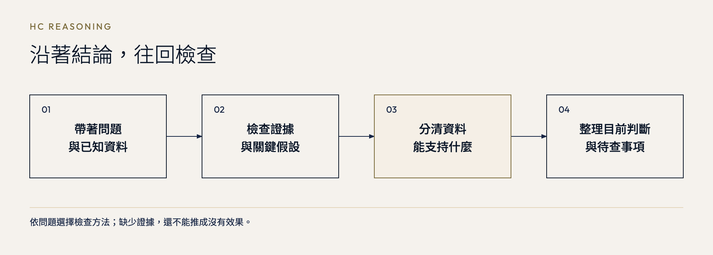

# HC Reasoning

### 這個結論，真的站得住腳嗎？

月報的數字變差，就該撤掉新流程嗎？履歷沒回音，先買證照課就有幫助嗎？HC Reasoning 幫你沿著結論往回查，分清資料能支持什麼、解法是否對得上問題，再決定下一步。

你可以貼上報告、檢查準備執行的計畫，或把遇到的狀況說清楚，先看看解法是否對得上問題。

[MIT](LICENSE) · 繁中手冊，回答跟隨你的語言

[安裝](#install) · [開始使用](#first-use) · [使用範例](#examples) · [參考手冊](#handbook) · [English](#english)

<a id="install"></a>
## 安裝

先選你使用的介面，不需要自己打包檔案。

| 你使用的介面 | 安裝入口 |
|---|---|
| Claude 網頁版／Desktop | [下載 skill ZIP](https://github.com/kcchien/hc-reasoning/releases/latest/download/hc-reasoning-claude-skill.zip) → **Customize → Skills → + → Create skill → Upload a skill** → 啟用。不用解壓縮；[找不到選單？](INSTALL.md#claude) |
| Codex／ChatGPT desktop 的本機工作模式 | [下載 OpenAI plugin ZIP](https://github.com/kcchien/hc-reasoning/releases/latest/download/hc-reasoning-openai-plugin.zip)，依[桌面安裝步驟](INSTALL.md#openai-desktop)加入本機市集 |
| ChatGPT 網頁版 | [查看工作區上傳與 Plugins Directory 的適用條件](INSTALL.md#openai-web)；不要把 ZIP 當一般聊天附件上傳 |

Claude Code、Codex CLI、Cursor 等開發工具，以下兩種 Skills CLI 安裝方式擇一即可。

### 交給 AI agent 安裝

將這段完整貼給你使用的 agent：

```text
請用 Skills CLI 從 https://github.com/kcchien/hc-reasoning 安裝 hc-reasoning，並確認安裝結果。
```

### 自行在終端機安裝

需要 [Node.js](https://nodejs.org/en/download) 與 [Git](https://git-scm.com/downloads)。在你要使用 skill 的專案目錄開啟終端機，執行：

```sh
npx skills@latest add https://github.com/kcchien/hc-reasoning
```

依提示選擇你的 agent 與安裝範圍：只用在這個專案選 **Project**；希望其他專案也能使用則選 **Global**。其他選項見 [Skills CLI 安裝說明](https://github.com/vercel-labs/skills#install-a-skill)。

### Codex 桌面版：貼上這段即可開始安裝

在可存取本機檔案的 Codex／ChatGPT Work 對話貼上：

```text
請下載 https://github.com/kcchien/hc-reasoning/releases/latest/download/hc-reasoning-openai-plugin.zip，檢查並解壓縮，用 plugin-creator 加入我的本機 plugin 市集，保留其他項目，完成安裝並確認結果；不要發布或分享。
```

完成後重新啟動桌面 app，在 Plugins Directory 選取本機市集並確認已啟用，再開新對話。[詳細步驟與適用條件](INSTALL.md#openai-desktop)。這不是網頁版的 ZIP 上傳指令；網頁版入口見 [安裝說明](INSTALL.md#openai-web)。

<a id="first-use"></a>
## 安裝後，試第一個問題

在剛才選擇的 agent 開啟新對話，貼上：

```text
請用 hc-reasoning 幫我判讀這份客服月報：
上月簡單案件 800 件，平均首次回覆 1 小時；複雜案件 200 件，平均 10 小時。
本月簡單案件 200 件，平均 0.8 小時；複雜案件 800 件，平均 8 小時。分類規則相同。
試了新分流流程後，整體平均從 2.8 小時變成 6.56 小時。主管想撤回，團隊卻說兩類都變快就是新流程有效。同期產品也改版了，只有這兩個月資料、沒有對照組。
明天要開會：現在能說什麼、不能說什麼，下週該怎麼做？
```

之後把情境換成你自己的問題即可。若 agent 找不到 skill，先確認安裝時選的是同一個 agent；若選了 Project，也要在同一個專案開啟對話。仍有問題可[回報安裝問題](https://github.com/kcchien/hc-reasoning/issues/new)。

## 為什麼做這個工具

很多結論看起來合理，是因為中間幾步被省略了。把省下的時間乘上時薪，就當成省下的支出；看到兩件事一起出現，就認為其中一件造成另一件。HC Reasoning 想把這幾步攤開，讓你知道該查什麼，再決定要相信多少。

HC Reasoning 的想法受到 Minerva University 的 Habits of Mind 與 Foundational Concepts（HCs）啟發。前者是透過練習逐漸養成的認知技能，後者是可以用在不同情境的基礎知識。Minerva 的歷史官方介紹把它們放在批判思考、創造思考、有效溝通及有效互動四項能力之下。[官方介紹，頁 2–3](https://www.minerva.edu/public/media/enrollment-center/Minerva-HCs-Intro.pdf)

本工具把這些觀念整理成可以照著做的檢查。例如讀一份調查，先看受訪者怎麼選，再找其他可能解釋，最後確認結果能不能用在你的情境。每個方法都附上適用時機、具體做法與容易誤判的地方。

做成 skill，是希望讀報告、開會或準備做決定時，不必每次都從頭交代該怎麼檢查。你不用先背 HC 名稱；想知道 AI 依照什麼做判斷，也能打開 [SKILL.md](SKILL.md)，查看或修改指引。

這是獨立改編的工具，與 Minerva University 沒有隸屬或背書關係，也不提供其完整課程。手冊採用本專案整理的工作清單（working set），不是官方完整或現行版本；範圍與來源見 [來源紀錄](sources/provenance.md)。

## 三種用法

| 你想做什麼 | 怎麼開口 |
|---|---|
| 檢查一份報告或數字 | 貼上原文與已知方法，問「這些資料能支持什麼結論？哪些還不能？」 |
| 檢查準備執行的決定 | 說明目的、選項與限制，問「哪個假設不成立，就會改變這個決定？」 |
| 確認解法是否對得上問題 | 描述遇到的狀況與預計做法，問「這個方法處理得到原因嗎？還需要知道什麼？」 |



回答會先說目前怎麼看，再交代理由，以及哪些資訊會讓判斷改變。資料不齊時，會說清楚還不能確定什麼。簡單問題可以簡答；想多查一步或學一個 HC，也可以直接說。

<a id="examples"></a>
## 用在自己的問題上

以下是實際執行的示範，情境與數字都是設定，引用保留回答原文。[完整提問與回答](EXAMPLES.md)都可以直接複製。

### 客服成效：平均回覆變慢，該撤掉新流程嗎？

四人客服團隊試了新分流流程，月報顯示首次回覆時間從 2.8 小時變成 6.56 小時。主管想撤回，團隊卻說兩類案件都變快了。

| 月報資料 | 上月 | 本月 |
|---|---|---|
| 簡單案件 | 800 件，平均 1 小時 | 200 件，平均 0.8 小時 |
| 複雜案件 | 200 件，平均 10 小時 | 800 件，平均 8 小時 |
| 實際整體平均 | 2.8 小時 | 6.56 小時 |

**轉折在案件組成。** 複雜案件占比從兩成變成八成；固定使用上月比例來比較，本月會是 2.24 小時。但它只是固定比例的比較值，不能取代客戶實際等候的 6.56 小時，也不能證明新流程造成改善。

只有兩個月資料，又碰上產品改版，現在無法替任何一方宣布勝利。明天仍得開會，回答沒有停在「資料不足」：

> **把決策改成「有條件暫留、必要時局部回復」，而不是宣布新流程成功。**

下週先查超時、漏接或反覆轉派的案件。若找到新分流造成的明確損害，而且舊做法能避開卡點，就先調整受影響環節；暫留則以維持成本與服務風險可接受為前提。

**帶回工作的是：**向主管說明的段落，以及把「實際平均、案件組成、分類表現」分開呈現的報表做法。

[複製月報情境與完整會議建議](EXAMPLES.md#hc-support-results)

### 轉職準備：履歷沒回音，就該先考證照嗎？

行政工作三年，想半年內轉做資料分析。投十二份履歷、拿到兩次面試，都沒錄取；一家說專案經驗不夠。十二份職缺中，九份提 SQL、七份要視覺化經驗，四份把證照列為加分，沒有一份列為必要。

你正考慮三萬六千元的證照課，每週要六小時，但你只有五小時。回答先把「履歷沒回音」與「面試後未錄取」分開：它們可能卡在不同環節，不能只用少一張證照解釋。

可以直接問招募者：

> 「以這份職缺和我的履歷，最可能讓我未通過初篩的是哪一項？若其他內容不變，只補上這張證照，會實質改變是否邀請面試嗎？為什麼？」

問完之後，安排真的可能不同：

| 得到的具體回饋 | 準備方向 |
|---|---|
| 證照確實是目標職缺的篩選條件 | 提高考照優先度，再檢查時數與其他取得方式 |
| 技術或作品不足 | 補對應的 SQL、資料處理或視覺化證據 |
| 經驗有，但面試時沒有講清楚 | 先改專案敘事與表達 |
| 硬性要求正式分析工作經驗 | 考慮內部分析任務或過渡職缺，作品與證照未必能取代 |

**帶回個人成長的是：**三個向招募者／前輩提問的句子、一週五小時的準備順序，以及哪些回答值得讓自己改變安排。既有月報不能公開時，回答也說明如何用合成資料展示方法，而不冒充公司實績。

[複製完整情境、三個問題與五小時安排](EXAMPLES.md#hc-career-certificate)

**補上新資訊，建議會改嗎？**

接著追問：補習班更正為每週五小時，課綱含目標 SQL 任務與每週個別回饋；你能負擔學費、配合固定時段，但過去自學常拖延。另一條路是八千元、四週兩次作品檢視。招募者也確認，他們的職缺看重 SQL 與專案，證照不是門檻。

> **會改變：我會從「下週先不報名」調整為「有條件偏向報課」，但理由是固定節奏與技能訓練，不是證照。**

條件是先確認：能否在五小時內，讓你獨立完成作業、得到具體回饋、修改後再檢查？如果只是照範本操作，或其實需要大量額外練習，回答會轉向自學加回饋。費用不退，因此「老師逐人講評」還需要實際作業與修改案例來支持；一份示例也不能代表所有學員的體驗。

[看完整追問、兩條路的比較與報名前的一個問題](EXAMPLES.md#hc-career-followup)

### AI 採購：每月省四十二萬，為什麼還要先確認效益？

十位自願試用者自評每天省四十分鐘。提案用這個數字外推到八十位員工，換算每月四十二萬多元，建議每人每月六百元全面採購。

| 需要分開的三件事 | 對採購決定的影響 |
|---|---|
| 時間乘上時薪 | 約 42.7 萬元是估算的人力價值；薪資與外包若未減少，就不是現金節省 |
| 每人每月六百元 | 八十人的訂閱費是每月實際增加 4.8 萬元 |
| 十位自願者的自評 | 還要確認其他職務是否適用，以及檢查、修改後的總工時、品質與完成量 |

回答最後保留了值得買的可能：

> 若特定職務能穩定增加有價值的產出，且足以抵銷訂閱、導入與管理成本，就先採購該群體，再依證據擴大，而非直接外推到八十人。

**帶回會議的是：**先談哪些職務、哪些成果足以支持採購，而不是只爭論「四十二萬算得對不對」。具體採購門檻仍需依公司成本與目標約定，不能由這份自評直接推出。

[複製提問與完整採購建議](EXAMPLES.md#hc-ai-budget)

<details>
<summary>日常判讀：每天閱讀半小時，薪水就會增加兩成？</summary>

一份五百人的問卷發現，閱讀較多的上班族平均年薪高兩成。你每週只有三小時，正在猶豫要讀書還是練工作技能。

> **這份摘要最多支持「受訪者中，閱讀較多的人平均年薪較高」，不能支持「每天讀半小時會讓你加薪」，更不能把兩成當成你的預期加薪幅度。** 不過，這不代表閱讀沒有幫助；只是這份調查無法回答它的因果效果。

回答把「想讀書」與「想提高收入」分開，讓興趣不必靠加薪證明值得。若目的是工作表現，就先找會被實際使用、也被考核認可的能力；每週一小時閱讀、兩小時技能練習只是可調整的起點。

[複製調查情境與完整時間安排](EXAMPLES.md#hc-reading-claim)

</details>

<a id="handbook"></a>
## 參考手冊，按問題取用

你不必先讀完整份手冊。想看檢查方法、適用條件或自行修改，可以從這三章開始。

| 章節 | 裡面在處理什麼 |
|---|---|
| [決策檢視](references/decision-review.md) | 目的是否清楚、選項有哪些代價、哪些假設會改變決定 |
| [證據檢核](references/evidence-check.md) | 資料從哪裡來、跟什麼比較、能不能解釋原因或用到其他情境 |
| [問題界定](references/problem-framing.md) | 分清症狀、原因與解法，找出還需要確認的條件 |

每章都有適用情境、具體做法、常見失誤與限制。想找特定 HC 名稱，可查 [HC 索引](references/hc-index.md)；部分項目只有簡要說明，並非每一項都有完整教學。

## 回報問題或參與修改

如果某句推論不成立，或你找到更好的用法，歡迎[回報問題或建議](https://github.com/kcchien/hc-reasoning/issues/new)。請附上去除私人資訊後的提問、原始回答，以及你認為需要修正的地方。內容修正也歡迎附上一級來源；細節見 [參與修改](CONTRIBUTING.md)。

<a id="english"></a>
## English

**Know what holds.**

Inspired by Minerva University’s Habits of Mind and Foundational Concepts, this independent adaptation makes reasoning checks explicit: what to notice, what to examine, and where a conclusion stops being supported. It is not a Minerva product, curriculum replica, or official HC list.

Review whether a problem is framed well, what the evidence supports, and which conditions a conclusion depends on. Use it for decision review, evidence checks, or problem framing. It gives an initial judgment before asking for information that could change it.

**Install with your agent** — paste this entire prompt:

Using Claude web/Desktop or OpenAI desktop/web instead? See the [platform-specific installation guide](INSTALL.md#english). The Skills CLI instructions below are for coding agents with terminal access.

```text
Use Skills CLI to install hc-reasoning from https://github.com/kcchien/hc-reasoning and verify the installation.
```

**Install in a terminal** — requires [Node.js](https://nodejs.org/en/download) and [Git](https://git-scm.com/downloads). Run this in your project directory:

```sh
npx skills@latest add https://github.com/kcchien/hc-reasoning
```

Select your agent, then choose **Project** for this project only or **Global** to use it across projects. See the [Skills CLI installation guide](https://github.com/vercel-labs/skills#install-a-skill) for other options.

**Try it** — start a new conversation in the selected agent and paste:

```text
Use hc-reasoning to review this support report. Last month: 800 simple cases averaged 1 hour to first reply; 200 complex cases averaged 10 hours. This month: 200 simple cases averaged 0.8 hours; 800 complex cases averaged 8 hours. The classification rules stayed the same. After a new routing process, the overall average rose from 2.8 to 6.56 hours. The manager wants to revert, while the team says the process worked because both categories improved. A product update happened at the same time; there is no control group. What can we conclude, and what should we do next week?
```

If the skill is not found, check that you selected the same agent and, for a Project installation, opened the same project. [Report an installation problem](https://github.com/kcchien/hc-reasoning/issues/new) if it persists.

The index is a working set, not an official complete or current list. See [sources and scope](sources/provenance.md).

## 授權 / License

本專案原創手冊以 [MIT License](LICENSE) 提供。外部來源的原文、名稱與商標各依原權利人的授權；本授權不重新授權外部文件。

Original handbook material is provided under the MIT License. Referenced publications and trademarks remain subject to their owners’ rights.
